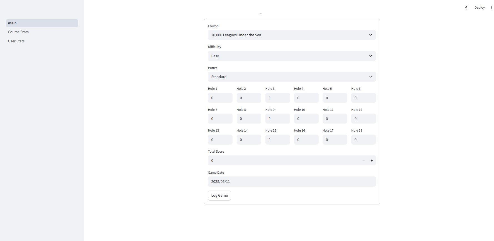

# Walkabout Mini-Golf Companion App

Welcome to the Walkabout Mini-Golf companion app. I built this because I love the game and wanted to track my own progress over time, and I am offering it up to other players whow would love to do the same.  
  
The app is currently not ready to use as I have several more features I need to add and cleanups I need to do.  
  
#### Current Features - Overall User Stats
- Log each game of golf for every course relased so far for both easy and hard versions ofcourses.  
- See your overall stats such as best game, worst game, best easy and best hard courses.
- Most and least played courses.
- A chart of total played games for each course.  
  
#### Current Features - Overall User Stats  
- Sea your average score, standard deviation, and variance for any course and difficulty combo.
- See a chard of your normal distrobution of scores for each course and difficulty.
- View a time series of your scores for a course. 

### Screenshots  
The Follawing images were created using prepopulated_fake data from my test database. Hopefully your real data will show you improving :D  
  

  
### Things To Do
- ~~Streamlit does not cache polars dataframes, so while I would love to use polars over pandas I will have to use pandas for the time being. I did not realize this until I had written a bunch of the code to use polars so I will simply replace it with pandas code. This is why there is some code that converts polars dataframes to pandas for use in charts etc for now.~~
- ~~Add the ability to see games farthest under par and not just lowest score.~~
- Add code to allow users to select what putter they played a game with.
- Add functionality to include best games on average with a certain putter.
- Add calculation to show what percentage of games you finish under par.
- Add ability to see data for each hole on a course, including time series and average strokes data.

    
 

